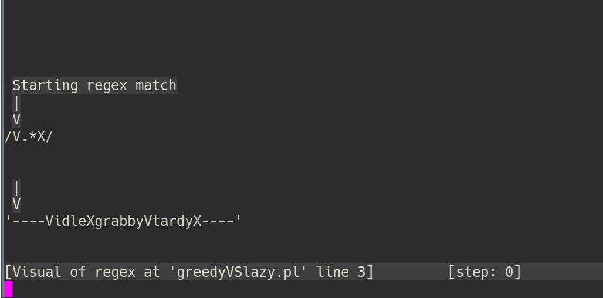

# linux-practical
The content here is part of my book “Linux Practical Guide”. More content for public use will be gradually released.

The goal of this book is to deepen understanding through visualization and illustrations, ing explanatory examples rather than memorizing the examples. It should be an impetus to use Linux intelligently and close the likely skills gap.

Occasionally, details are discussed in great detail in order to trigger a case-specific rethink.

For example, we learn different methods for renaming multiple files at the same time under Linux. We will
See a variety of command line examples that cover many different scenarios or are slightly similar can be adapted to certain situations.

If certain syntax seems incomprehensible, analyze the code and question all the details. If you still get stuck, leave it for a while and then return. 
You'll learn better by figuring it out yourself rather than reading about it.

I would offer all SVG versions of the animation as well as the entire book here as long as the costs of the book are somewhat covered.

Mail: printf "bGludXgtZ3VpZGVAcHJvdG9uLm1lCg==" | base64 -d

Visualized, pauseable animations that mimics the regex engine as SVG for whatever reason, it is not rendered here. 
Please download it and open it in the browser. View it here as a still image

